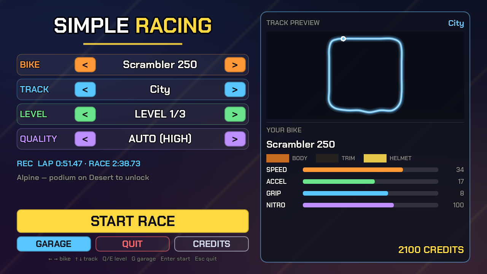
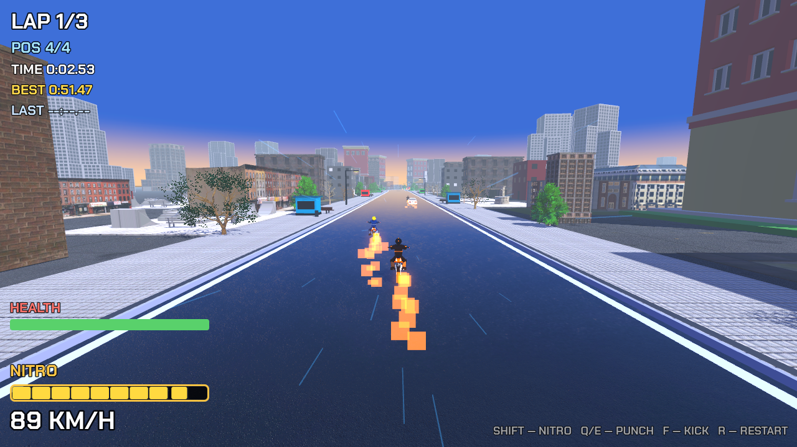
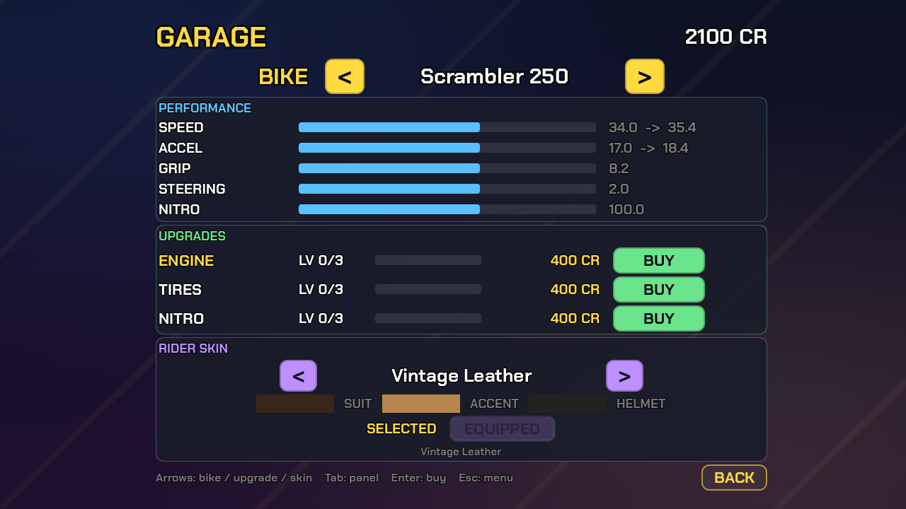
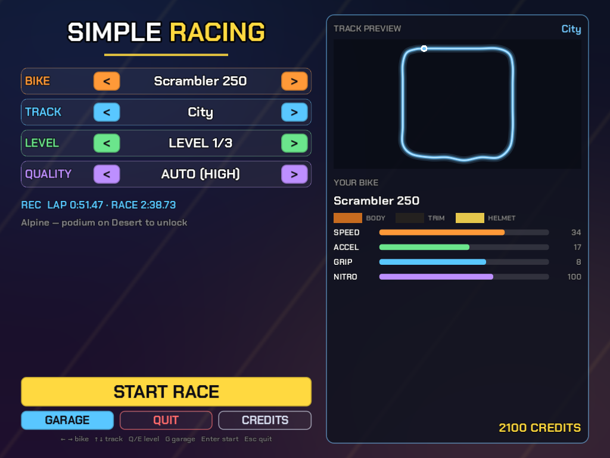
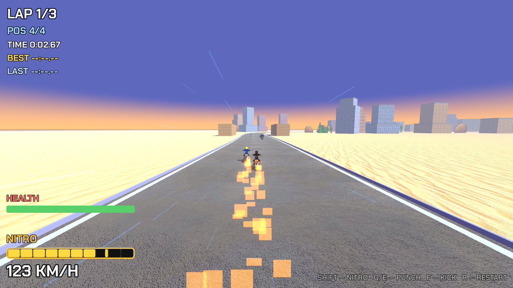

# SimpleRacing (MotoRacing)

Аркадные мотогонки в духе **Road Rash**: скорость, трафик, полиция и драки прямо
на трассе. Cel-shaded 3D на **Godot 4.7** (Forward+), ориентировано на ПК и Android.







Интерфейс масштабируется под любое окно и разрешение (в т.ч. 4:3):





## Возможности

- **15 трасс в 7 биомах** — город, пустыня, альпы, побережье, каньон, сакура,
  вулкан. Геометрия каждой трассы задаётся сплайном контрольных точек.
- **3 уровня сложности** на трассу с отдельными рекордами (лучший круг и гонка).
- **10 байков**: scrambler, sport, cruiser, super, dirt, chopper, electric и три
  именных байка боссов. Реальные GLB-модели + процедурный райдер на скелете
  с двухкостным IK на руль и подножки.
- **Гараж** — прокачка двигателя, шин и нитро (по 3 уровня), выбор скина райдера
  и покупка босс-байков за кредиты.
- **Скины райдера** — 8 схем с декалями-эмблемами; часть открывается за прогресс.
- **Боёвка Road Rash** — удары влево/вправо (Q/E) и пинок (F), здоровье, нокдаун
  и фазовый вайпаут с возвратом на байк.
- **Противники** — трафик из 8 машин, агрессивные ИИ-соперники и **полиция**
  (при скорости ниже 6 м/с рядом с копом — BUSTED).
- **Именные боссы** на canyon / sakura / volcano с собственной раскраской и
  наградой за победу.
- **Пикапы и опасности** — нитро, аптечка, деньги, щит, масло и конусы.
- **Кампания** — подиум открывает следующую трассу, а кредиты идут в магазин и
  гараж; прогресс сохраняется в `user://progress.cfg`.
- **Графика** — cel-шейдинг с обводкой, пресеты качества LOW/MEDIUM/HIGH + AUTO,
  MSAA и анизотропная фильтрация.
- **Мобильное управление** — экранный пад (руление, газ, тормоз, нитро, удары)
  с поддержкой мульти-тача; на ПК включается по F4.

## Управление

### Заезд

| Клавиши            | Действие                          |
| ------------------ | --------------------------------- |
| `W` / `↑`          | Газ                               |
| `S` / `↓`          | Тормоз / задний ход               |
| `A` / `D`, `←` / `→` | Руление                         |
| `Shift`            | Нитро                             |
| `Q` / `E`          | Удар влево / вправо               |
| `F`                | Пинок                             |
| `R`                | Рестарт                           |

### Меню и гараж

| Клавиши       | Действие                                              |
| ------------- | ----------------------------------------------------- |
| `←` / `→`     | Выбор байка                                           |
| `↑` / `↓`     | Выбор трассы (меню) / апгрейда (гараж)                |
| `Q` / `E`     | Уровень сложности (меню)                              |
| `Tab`         | Переключение панели (гараж: апгрейды / скин)          |
| `G`           | Гараж                                                 |
| `Enter`       | Старт гонки (меню) / покупка (гараж)                  |
| `Esc`         | Выход (меню) / назад (гараж)                          |
| `F4`          | Тумблер тач-управления (десктоп)                      |

## Запуск из исходников

Нужен **Godot 4.7** (стабильный).

```bash
godot --path .
```

Главная сцена — `scenes/menu.tscn`.

## Сборка под Android

В проекте настроен экспорт-пресет **Android** (arm64-v8a, пакет
`ru.alex.simpleracing`). Понадобятся Android SDK, JDK и отладочный keystore,
прописанные в настройках редактора Godot, а также установленный Android build
template (`android/` в `.gitignore` — ставится через
*Project → Install Android Build Template*).

```bash
# debug APK
godot --headless --path . --export-debug "Android" build/simpleracing-debug.apk

# установка на подключённое устройство
adb install -r build/simpleracing-debug.apk
```

## Структура проекта

```
scenes/       меню, гонка, гараж
scripts/      игровая логика (физика байка, ИИ, полиция, трафик, трассы, UI)
assets/
  data/       трассы, байки, трафик, скины (.tres)
  bikes/      GLB-модели байков
  environments/  текстуры биомов (дороги, террейны, фасады, небо)
  shaders/    cel/toon-шейдеры
  ui/         шрифты, иконки тач-управления
tools/        headless-проверки и генераторы ассетов
docs/         документация и скриншоты
```

Проверки баланса, магазина, кампании, боя и механик запускаются headless:

```bash
godot --headless --path . -s tools/check_tuning.gd
```

## Ассеты и лицензии

Модели мотоциклов, машин, зданий и деревьев — **CC-BY 4.0** (Sketchfab и
OpenGameArt); часть городских объектов — CC0. Полный список авторов — в экране
**CREDITS** в игре, в `docs/assets.md` и в файлах `*.license` рядом с ассетами.
